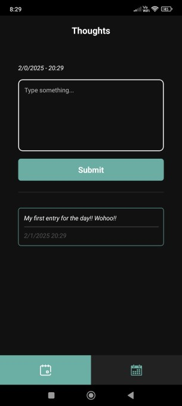
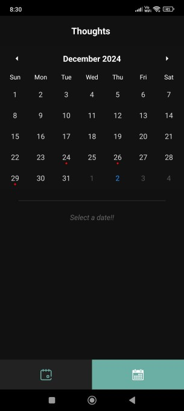
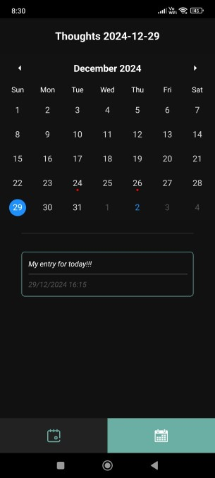

# Thoughts App

A simple app built with React Native to help journal your daily thougts

## Home Screen:

Home Screen provides a clean interface for the user to enter his/her thoughts. 

The user can also see all the thoughts they have submitted for the day with timestamp.

## Calendar View:

Using the bottom Nav-Tab, user can see the Calendar View provided.

In this view user can see a month view of the current month. All the days where user have submitted a entry, a red dot is displayed denoting an entry.

User can tap on a particular day from the calendar view to see all entries from the day with their respective timestamps.

## About the code:

The app dosen't use any backend or any storage service. The app stores all data locally using a key combination (month + year).

The app tries to provide an easy to use interface for user to help with journaling.